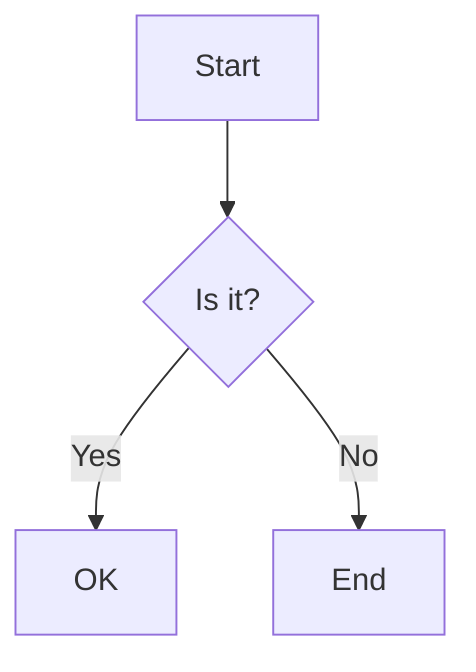

# Diagrams



```vega-lite
{
  "$schema": "https://vega.github.io/schema/vega-lite/v5.json",
  "data": {"values": [{"a": "A", "b": 28}, {"a": "B", "b": 55}, {"a": "C", "b": 43}]},
  "mark": "bar",
  "encoding": {"x": {"field": "a", "type": "nominal"}, "y": {"field": "b", "type": "quantitative"}}
}
```

```ts
export function add(a: number, b: number): number {
  return a + b; // sum
}
```

~~~python title="example.py"
def greet(name):
    return f"hello {name}"
~~~

    indented code block
    second line
